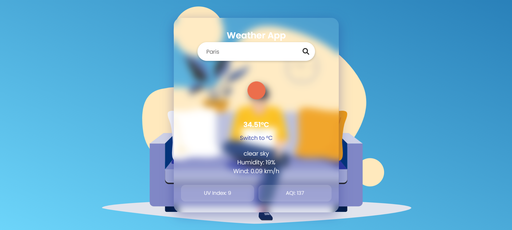

# Responsive Weather App

A beautiful, modern, and fully responsive weather application that shows real-time weather data for any city using the OpenWeatherMap API. Built with HTML, CSS, and JavaScript, it features a clean glassmorphism UI, animated weather icons via Lottie, and mobile-first responsiveness.

---

## Screenshot



--- 

## Features

- City-based weather search  
- Toggle between Celsius (°C) and Fahrenheit (°F)  
- Live weather icons using OpenWeatherMap  
- Animated weather backgrounds using Lottie  
- Humidity, Wind Speed, UV Index, AQI display  
- Clean, glass-style UI (Glassmorphism)  
- Fully responsive for desktop, tablet, and mobile  

---

## Technologies Used

- **HTML5** – Page structure  
- **CSS3** – Styling with responsiveness  
- **JavaScript** – Logic, API calls, interactivity  
- **OpenWeatherMap API** – Weather data  
- **Lottie Web** – Weather-specific background animations  
- **Font Awesome** – Weather icons  

---

## How to Run the Project

### Prerequisites:
- Browser (Chrome, Edge, Firefox, etc.)
- Code editor (e.g., VS Code)
- [OpenWeatherMap API Key](https://openweathermap.org/api)

### Steps:
1. Clone the repository or download the ZIP.
2. Replace the `apiKey` in `script.js` with your OpenWeatherMap key.
    ```js
    const apiKey = "YOUR_API_KEY_HERE";
    exit
3. Open `weather_index.html` in your browser.
4. Type a city and hit the search icon.


## API Used
- Endpoint: https://api.openweathermap.org/data/2.5/weather
- Method: GET
- Parameters: q, appid, units=metric

## Folder Structure

📁 Weather App
│
├── 📄 weather_index.html     # Main HTML file
├── 📄 style.css              # CSS styles (glass UI + responsive)
├── 📄 script.js              # JS logic, API call, animations
└──  result_img.png           # Project screenshots


## Developed by

Arshiya Saiyyad
Weather UI & API Integration Project


